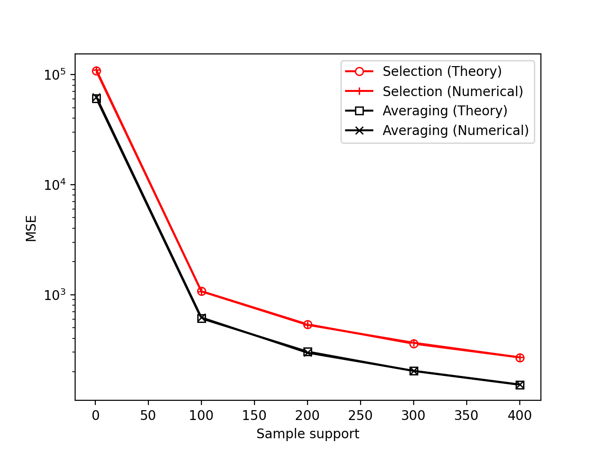

## The-mean-squared-error-of-autocorrelation-sampling in coprime arrays


In this repo we study the Mean-Squared-Error (MSE) estimation performance attained by autocorrelation selection sampling and averaging sampling in coprime arrays. Specifically, we show that the MSE closed-form expressions derived in [[1]](https://ieeexplore.ieee.org/document/8313121) coincide, in MSE, with the empirical sample-average MSE computed across many realizations, for suffiently large number of realizations. 

---

IEEE Xplore: https://ieeexplore.ieee.org/document/8313121

---
**Examples**

We start by forming coprime array with coprime integers (M,N).
```python
import numpy as np
import matplotlib.pyplot as plt
from utils import *
from mse_expressions import *
# channel
carrier_frequency = 1 * 10 ** 7
propagation_speed = 3 * 10 ** 8
channel = (carrier_frequency, propagation_speed)
# Coprime array with coprimes M, N such that M < N
M = 2
N = 3
p = ca_element_locations(M, N, channel) 
```
Then, we consider DoAs each of which with some source-emitting power (linear scale) and noise power (also, linear scale).
```python
# DoA sources
thetas = np.array([-np.pi / 3, -np.pi / 4, np.pi / 5, 2 * np.pi / 5])
# source and noise powers
source_powers = np.array([10, 10, 10, 10])
noise_power = 1
```
We from the true autocorrelation matrix of the physical array.
```python
# Array response matrix
S = response_matrix(thetas, p, channel)
# Nominal Physical autocrrelation matrix
R = autocorrelation_matrix(S, source_powers, noise_power)
# autocorrelation sampling matrices
```
Next, we form the selection sampling and averaging sampling matrices, respectively. 
```python
# autocorrelation sampling matrices
Jdict = form_index_sets(M, N , pair_wise_distances(p), channel)
Esel = selection_sampling(Jdict, array_length(M, N), coarray_length(M, N))
Eavg = averaging_sampling(Jdict, array_length(M, N), coarray_length(M, N))
```
By applying spatial-smoothing, we form the true autocorrelation matrix of the coarray. 
```python
# Nominal coarray autocorrelation matrix
F = smoothing_matrix(coarray_length(M, N))
Z = spatial_smoothing(F, Esel.T @ R.flatten('F'))
```
We initialize error vector/matrices.
```python
number_of_snapshots_axis = [1, 100, 200, 300, 400]
number_of_realizations = 1500
# Zero - padding
err_sel_theory = np.zeros(len(number_of_snapshots_axis), )
err_avg_theory = np.zeros(len(number_of_snapshots_axis), )
err_sel_numerical = np.zeros((len(number_of_snapshots_axis), number_of_realizations))
err_avg_numerical = np.zeros((len(number_of_snapshots_axis), number_of_realizations))
```
We evaluate the closed-form MSE expressions of [[1]](https://ieeexplore.ieee.org/document/8313121) (outer-loop) and
collect measurements of the MSE across different realizations of noise (inner-loop).
```python
for i, Q in enumerate(number_of_snapshots_axis):
    # Evaluate the theoretical MSE expressions only once per value of sample support
    err_sel_theory[i] = selection_mse(source_powers, noise_power, coarray_length(M, N), Q)
    err_avg_theory[i] = averaging_mse(thetas, source_powers, noise_power, coarray_length(M, N), Q, Jdict, p, channel)
    # For each value of sample support, compute empirically the MSE
    for j in range(number_of_realizations): 
        Y = snapshots(S, source_powers, noise_power, Q)
        Rest = autocorrelation_matrix_est(Y)
        r = Rest.flatten('F')
        Zsel = spatial_smoothing(F, Esel.T @ r)
        Zavg = spatial_smoothing(F, Eavg.T @ r)
        err_sel_numerical[i , j] = np.linalg.norm(Z-Zsel, 'fro') ** 2
        err_avg_numerical[i , j] = np.linalg.norm(Z-Zavg, 'fro') ** 2
```
Finally, we plot in a single figure both the theoretical and empirical MSEs for comparisons. 
```python
# Compute the sample-average MSE
err_sel_numerical = np.mean(err_sel_numerical, axis = 1)
err_avg_numerical = np.mean(err_avg_numerical, axis = 1)
# Plot and compare MSE (theory) with estimated MSE (numerical)
plt.figure()
plt.semilogy(number_of_snapshots_axis, err_sel_theory, 'o-r', markerfacecolor = 'w', label = "Selection (Theory)")
plt.semilogy(number_of_snapshots_axis, err_sel_numerical, '+-r', label = "Selection (Numerical)")
plt.semilogy(number_of_snapshots_axis, err_avg_theory, 's-k', markerfacecolor = 'w', label = "Averaging (Theory)")
plt.semilogy(number_of_snapshots_axis, err_avg_numerical, 'x-k', label = "Averaging (Numerical)")
plt.legend()
plt.ylabel('MSE')
plt.xlabel('Sample support')
plt.show()
```
For sufficiently large number of realizations, the result should look like the following: 
 

---
**Questions/issues**
Inquiries regarding the scripts provided below are cordially welcome. In case you spot a bug, please let me know. 

---
**Citing**

If you use our algorithms, please cite [[1]](https://ieeexplore.ieee.org/document/8313121).

```bibtex
@INPROCEEDINGS{8313121,
  author={D. G. {Chachlakis} and P. P. {Markopoulos} and F. {Ahmad}},
  booktitle={2017 IEEE 7th International Workshop on Computational Advances in Multi-Sensor Adaptive Processing (CAMSAP)}, 
  title={The Mean-Squared-Error of autocorrelation sampling in coprime arrays}, 
  year={2017},
  volume={},
  number={},
  pages={1-5},
  doi={10.1109/CAMSAP.2017.8313121}}
```
[[1]](https://ieeexplore.ieee.org/document/8313121) D. G. Chachlakis, P. P. Markopoulos and F. Ahmad, "The Mean-Squared-Error of autocorrelation sampling in coprime arrays," 2017 IEEE 7th International Workshop on Computational Advances in Multi-Sensor Adaptive Processing (CAMSAP), Curacao, 2017, pp. 1-5, doi: 10.1109/CAMSAP.2017.8313121.

---

**Related works**

The following works might be of interest:

* [[2]](https://ieeexplore.ieee.org/document/8461676) D. G. Chachlakis, P. P. Markopoulos and F. Ahmad, "Mmse-Based Autocorrelation Sampling for Comprime Arrays," 2018 IEEE International Conference on Acoustics, Speech and Signal Processing (ICASSP), Calgary, AB, 2018, pp. 3474-3478, doi: 10.1109/ICASSP.2018.8461676.


